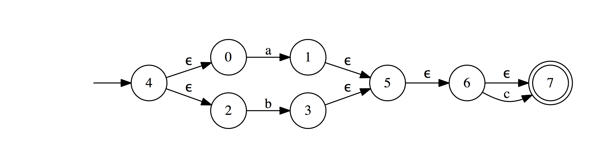
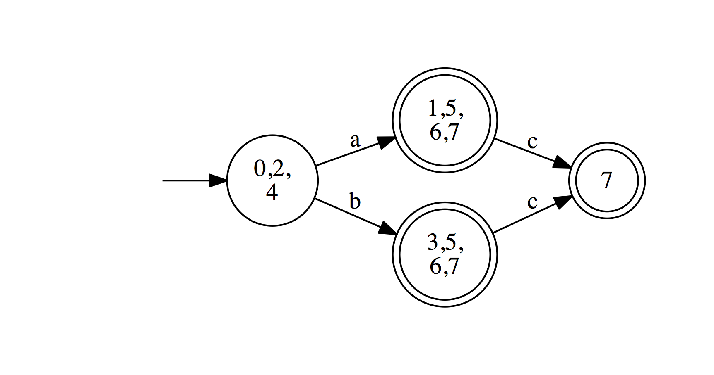
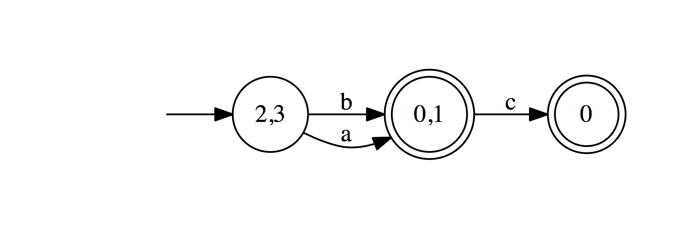

[README written in English](README.en-US.md)
------------------------------

# 什么是MicroRegEx
MicroRegEx是一个微型的正则表达式引擎.

## 所支持的Operator列表
* `*` - 零次或者更多次重复 
* `+` - 一次或者更多次重复
* `?` - 可选(零次或者一次)
* `a|b` - 匹配a或者b
* `(expr)` - 将`expr`作为原子
* `\` - 转义字符 

# 使用方法 
### 像python内建的regex一样使用
```python
import MicroRegEx

regex = MicroRegEx.compile("(a|b)cd*e?")
result = regex.match("abcde")
print(result)

result = regex.match("acde")
print(result)
```

将会输出:
```text
False
True
```

### 绘制NFA(非确定性有穷状态机)
```python
import MicroRegEx

regex = MicroRegEx.compile("(a|b)c?")
regex.plot()
```

绘制结果如下:


### NFA转换成DFA(确定性有穷状态机)
#### NFA to DFA
##### 原始的DFA
```python
import MicroRegEx
from MicroRegEx.Automaton.NFA2DFA import NFA2DFA

nfa = MicroRegEx.compile("(a|b)c?")

dfa = NFA2DFA(nfa).convert()
dfa.plot()
```

绘制结果如下:


##### 简化的DFA
```python
import MicroRegEx
from MicroRegEx.Automaton.NFA2DFA import NFA2DFA

nfa = MicroRegEx.compile("(a|b)c?")

dfa = NFA2DFA(nfa).convert().simplify()
dfa.plot()
```

绘制结果如下:


#### DFA最小化
##### Brzozowski方法 
```python
import MicroRegEx
from MicroRegEx.Automaton.NFA2DFA import NFA2DFA
from MicroRegEx.Automaton.Minimal.Brzozowski import Brzozowski

nfa = MicroRegEx.compile("(a|b)c?")

dfa = NFA2DFA(nfa).convert().simplify()
mini_dfa = Brzozowski(dfa).construct()
mini_dfa.plot()
```

绘制结果如下:


## 深入理解 MicroRegEx 的原理
为了更好的理解 MicroRegEx 是如何工作的，我提供了一个 [Jupyter Notebook](example/explain_code.ipynb)，用户可以按照其中的指引，一步一步的探索 MicroRegEx 的底层原理。

## 测试
通过了包含 64 个测试样例的测试数据的测试。
运行测试请执行 `python ./testing.py`

## License

本项目采用 MIT License - 具体细节见 [LICENSE.md](LICENSE.md) 文件

## 致谢与荣誉 
1. 灵感来自[xysun](https://github.com/xysun)的[regex](https://github.com/xysun/regex)项目
2. 少量部分文档来自[lihao98722](https://github.com/lihao98722/)的[regular\_expression\_engine](https://github.com/lihao98722/regular_expression_engine)项目
3. 测试数据来自[Glenn Fowler](http://www.research.att.com/~gsf/testregex/)项目的测试套装.
4. 测试脚本修改自[regex](https://github.com/xysun/regex)项目.

## 参考资料
* [Implementing Regular Expressions](https://swtch.com/~rsc/regexp/)
